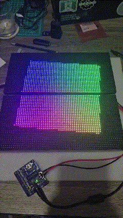

# Designing an RGBoard
You can build this system however you want but there are trade-offs.  
The version we’re showing here uses just two panels. Why? Because that was enough for our capstone project.
We actually considered going with a 2×2 layout, but in the end we saved money, time, and our sanity by sticking 
with a simpler 2×1 setup.

## Things to do prior to choosing parts and quantity

- Read the READMEs in the [rpi-rgb-led-matrix](https://github.com/hzeller/rpi-rgb-led-matrix).
  If you're about to make a mistake, is likely they did first and wrote about it. For example,
  don't get a Raspberry Pi 5 when the library states that is only supported up to the Raspberry Pi 4.
- We got our panels from [Adafruit](https://www.adafruit.com/). Check their inventory for panels and
  see which ones you like best for your RGBoard. Make sure is the ones with two IDC connectors in the back.
- The 64 x 32 panels can draw up to 4 amps each! When you add them up, your power supply system has to grow in
  size and cost.

## 1. Determine the size of your board

The size of your board plays a huge part in cost, power and computation.

### Daisy Chaining

You'll notice these boards have arrows drawn on the back to indicate
how your connections should flow. The output of one panel is the input to the next
following this direction. This allows you have a row of n panels.
Depending on the HAT, the adapting board that goes on the Raspberry and allows GPIO connections
to the input boards, you can set up rows on top of each other to make your canvas bigger. You can also
make a canvas with just series connection but will to transform your image on the software side.

### Power

Each panel, assuming they're 64 x 32, needs around 3.8 Amps when they're fully lit up, meaning all LED's set to white.
You can get a 5V 10A power supply for not much and that'll give you enough power for two panels and your Raspberry Pi.
However, as
you need more, you might want to consider more serious power supplies to power your system. This is where you need to
apply a little
electrical expertise.

### Is there a limit to how many I can chain?

The [rpi-rgb-led-matrix](https://github.com/hzeller/rpi-rgb-led-matrix) library supports up to 3 chains
with a theoretical number of 32 panels on each. That should be enough for most projects using a Raspberry Pi on
their design. If you are making something that requires much more than 3 x 32 panels, which would cost you thousands on
the panels alone,
and multiple power supplies... why are you trying to run that off an $80 computer?

## 2. Get a Raspberry Pi compatible with rpi-rgb-led-matrix

This computer is the central part of your computer. Get yourself a good amount of RAM
to have enough room for your programs that make up the whole system. It also makes remote development easier when
you do remote development with modern day tools. We recommend getting the
Raspberry Pi 4 Model B with a generous 8GB RAM.

## 3. Get LED matrix panel(s)

It can be one. It can be many. We recommend getting the panels from [Adafruit](https://www.adafruit.com/) but
you can also get them from other providers as long as they come with the HUB75 connector. Please
see [Panels supported](https://github.com/hzeller/rpi-rgb-led-matrix?tab=readme-ov-file#panels-supported) and
[Types of Displays](https://github.com/hzeller/rpi-rgb-led-matrix?tab=readme-ov-file#types-of-displays)
for more info.

## 4. Get a HAT connector

You may be thinking: "Haha, is a HAT because it goes on top of the Raspberry like a hat". WRONG!! It stands for "
Hardware Attached on Top" and is about
time you get professional. To make these work, you'll need 2x8 IDC ribbon cables. Your HUB75 connectors work with these
but your Raspberry Pi doesn't
have such terminal to physically connect these to. That's why you need a HAT that lets you do this.
See [Adapters](https://github.com/hzeller/rpi-rgb-led-matrix/tree/master/adapter) for a selection of library
recommendations.

Once you get the general idea of how to put the hardware components together in a way that is thought out. Ask yourself
these questions before checking out:

- Do I have compatible panels?
- Do I have enough power for the whole system (Panels + Raspberry Pi)?
- Do I have a [rpi-rgb-led-matrix](https://github.com/hzeller/rpi-rgb-led-matrix) compatible Raspberry Pi?
- Do I have the right amount of 8 x 2 IDC Ribbon cables and are they right length?

Once you got all these components hooked up. We can move on to the next section which would
be [software setup](/docs/software-setup.html).